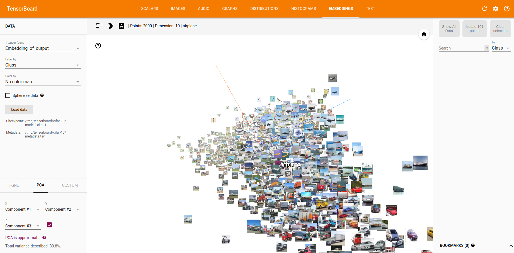

# tf_cifar

:jack_o_lantern: :jack_o_lantern:

thanks for these repo:

about embedding example: https://github.com/AloneGu/dl_tutorial/blob/master/tensorflow/debugging/embedding.py

about load cifar-10 and train: https://github.com/exelban/tensorflow-cifar-10

## download data

run notebook download_data

## run model

run notebook run

## vis

tensorboard --logdir=/tmp/tensorboard/cifar-10

open your browser 0.0.0.0:6006

you should see image like   :ghost:  :ghost:  :

Done!!!
